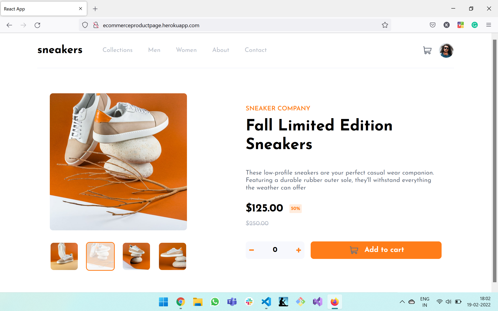

# Frontend Mentor - E-commerce product page solution

This is a solution to the [E-commerce product page challenge on Frontend Mentor](https://www.frontendmentor.io/challenges/ecommerce-product-page-UPsZ9MJp6). Frontend Mentor challenges help you improve your coding skills by building realistic projects.

## Table of contents

- [Overview](#overview)
  - [The challenge](#the-challenge)
  - [Screenshot](#screenshot)
  - [Links](#links)
- [My process](#my-process)
  - [Built with](#built-with)
  - [What I learned](#what-i-learned)
  - [Continued development](#continued-development)
  - [Useful resources](#useful-resources)
- [Author](#author)
- [Acknowledgments](#acknowledgments)

**Note: Delete this note and update the table of contents based on what sections you keep.**

## Overview

### The challenge

Users should be able to:

- View the optimal layout for the site depending on their device's screen size
- See hover states for all interactive elements on the page
- Open a lightbox gallery by clicking on the large product image
- Switch the large product image by clicking on the small thumbnail images
- Add items to the cart
- View the cart and remove items from it

### Screenshot



### Links

- Live Site URL: [Add live site URL here](http://ecommerceproductpage.herokuapp.com/)

## My process

#### Desktop first design

I started the process by creating components, and built the menu first later built the main section

### Built with

- Semantic HTML5 markup
- CSS custom properties
- Flexbox
- Desktop-first workflow
- [React](https://reactjs.org/) - JS library

### What I learned

- Planning the app before writing code is important
- Spliting the components more would be easier to work
- Styling

#### Some code iam proud of

```js
import { createContext, useState } from 'react'

const CartContext = createContext()

export const CartContextProvider = (props) => {
  const [noOfItems, setNoOfItems] = useState(0)

  const incrementItemsHandler = function () {
    setNoOfItems((prev) => prev + 1)
  }
  const decrementItemsHandler = function () {
    setNoOfItems((prev) => {
      if (prev > 0) return prev - 1
      else return 0
    })
  }

  const deleteItemsHandler = function () {
    setNoOfItems(0)
  }

  return (
    <CartContext.Provider
      value={{
        noOfItems: noOfItems,
        incrementItemsCount: incrementItemsHandler,
        decrementItemsCount: decrementItemsHandler,
        deleteItems: deleteItemsHandler,
      }}
    >
      {props.children}
    </CartContext.Provider>
  )
}

export default CartContext
```

### Continued development

I want to focus more on planning the app and better styling for the app
